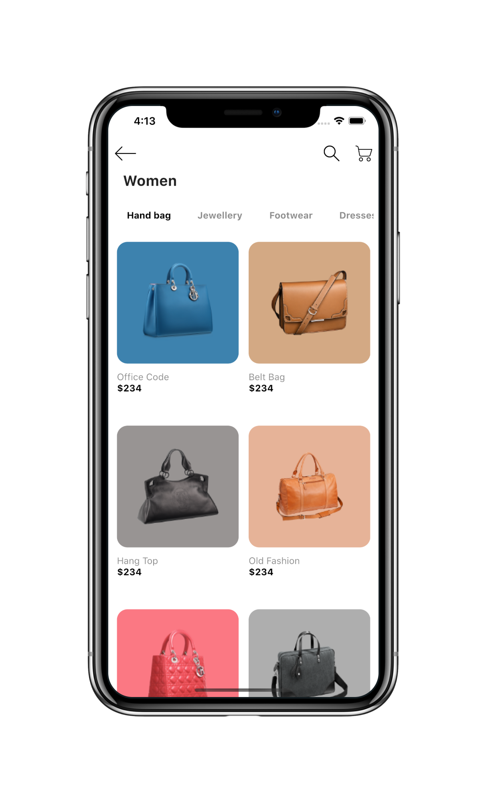
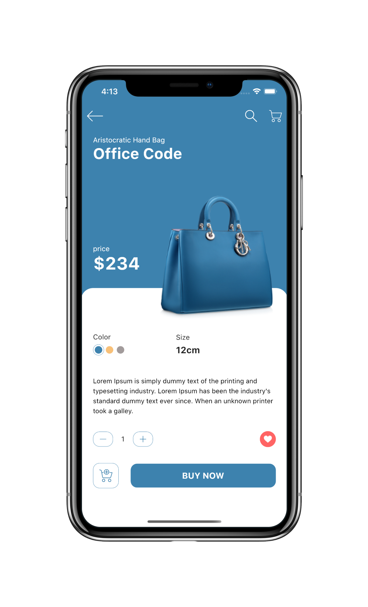

# Flutter UI - Food

English------[中文](README_CN.md)

### Introduction

Online shopping app UI

There are two pages, Page and Detail pages.

The Page page is mainly for horizontal classification and the following product list, and the Detail page is mainly for product introduction and purchase.

### Video

YouTube : [Watch it on YouTube]()

Bilibili : [Watch it on Bilibili]()

### UI 
 - Design by： Online shopping app UI  [link]( https://www.uplabs.com/posts/online-shopping-app-ui-974e28f2-dbc8-4d6b-90fd-cf0f0727f350)  
 - Author:  Morsalin Sarker  [link](https://www.uplabs.com/muhib_morsalin)  

### Online shopping Design UI

### Online shopping Final UI

   

