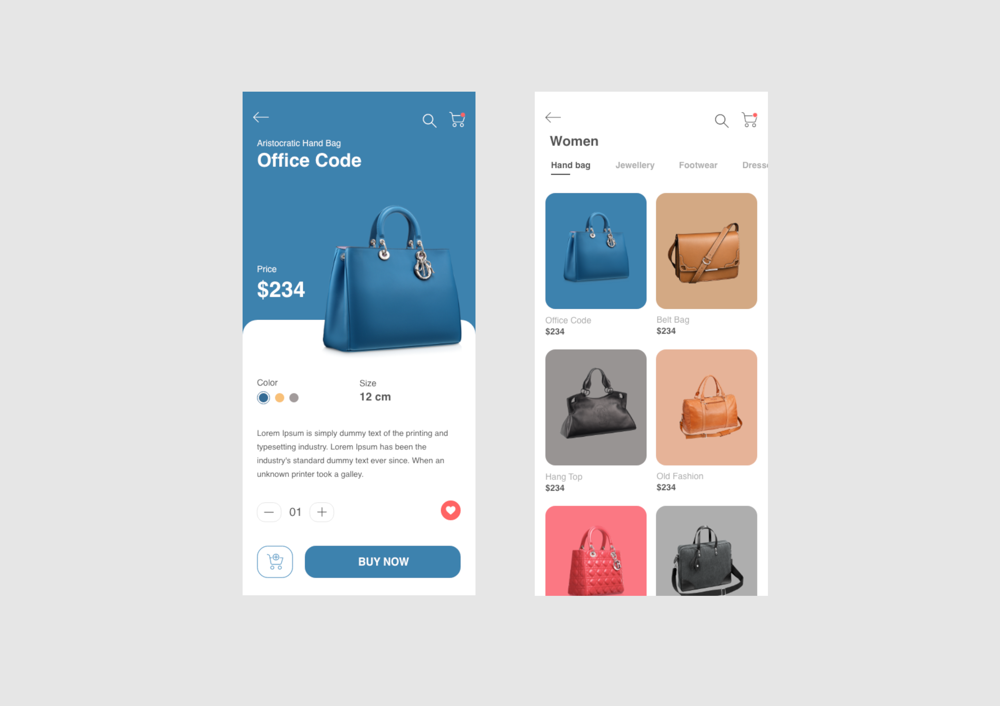
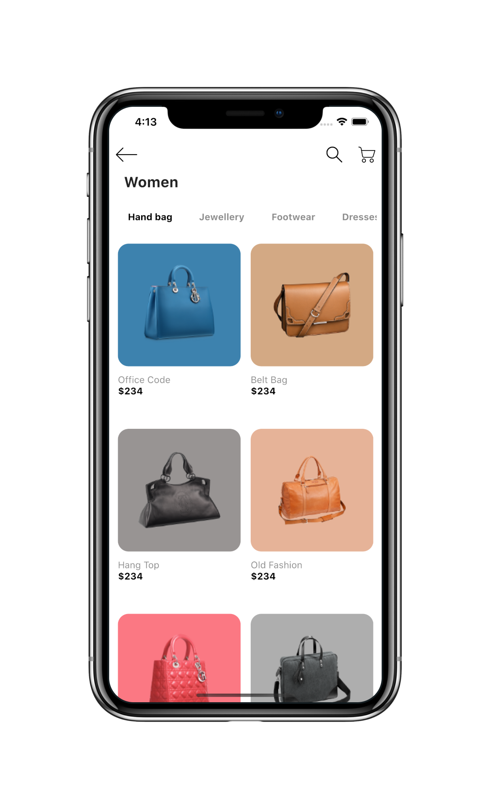
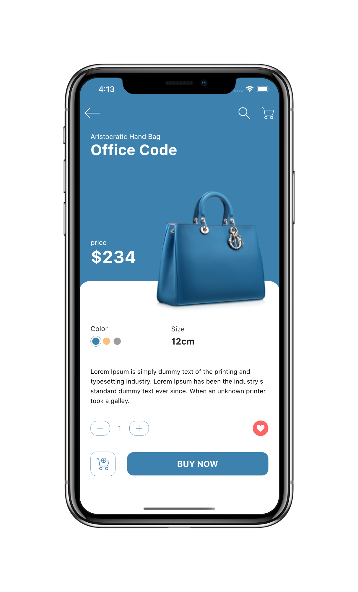

# Flutter UI - Food

[English](README.md)------中文

### 介绍

 Online shopping app UI

一共有两个页面，分别为 Page 和 Detail 页面。Page 页面主要为横向分类和下面的产品列表，Detail 页面主要分为商品的介绍和购买。

### 视频

YouTube : [观看地址]()

哔哩哔哩 : [观看地址]()

### 设计 
 - 设计： Online shopping app UI  [地址]( https://www.uplabs.com/posts/online-shopping-app-ui-974e28f2-dbc8-4d6b-90fd-cf0f0727f350)  
 - 设计者:  Morsalin Sarker  [地址](https://www.uplabs.com/muhib_morsalin)  

### Online shopping 设计稿

### Online shopping 最终完成

   

